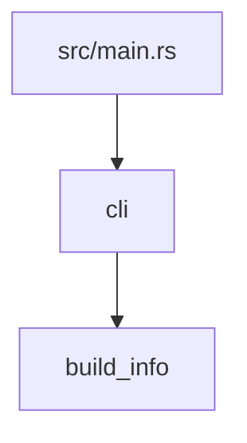

# Architecture

This page maps the [specification](spec.md) onto crates and modules and owns their boundaries.
Behavior lives in the specification; update this page in the same change that adds a module, a
crate or an edge.

## Repository layout

```text
agent-rs/
|-- src/
|   |-- main.rs              process wiring: arguments, locked streams, ExitCode from cli::run
|   |-- lib.rs               crate root: declares modules, crate-level docs
|   |-- cli.rs               command-line contract: clap parsing, help, streams, exit codes
|   `-- build_info.rs        build identity from the package manifest
|-- tests/                   black-box tests that run the built binary
|-- xtask/                   dev-only crate behind `cargo xtask`: ci, planning checks, dist
|-- docs/design/             specification, architecture, capability page template
|-- docs/impl/               plan.md, current.md, current/, records/
|-- docs/guide/              planning workflow, development guide
|-- .cargo/config.toml       `xtask` alias, static-runtime and cross-linker settings
|-- .github/workflows/       ci.yml (cargo xtask ci, dist); release.yml (tag -> GitHub release)
|-- AGENTS.md                canonical agent rules; CLAUDE.md, GEMINI.md, .cursor/ point to it
|-- Cargo.toml, Cargo.lock   workspace, package, lints, release profile; locked dependencies
|-- rust-toolchain.toml      pinned toolchain and components
`-- rustfmt.toml             formatting width
```

Add directories only when needed: `crates/<name>/` for a workspace crate, `benches/` for
Criterion or built-in benchmarks, `examples/` for runnable library examples, `tests/fixtures/`
for committed test inputs.

## Dependency direction



- `main.rs` calls only `cli::run`.
- `cli` is the only module that reads arguments or the environment, writes to stdout or stderr,
  or decides an exit code. It builds typed input and passes it down.
- Domain modules never import `cli`. Imports between them follow the edges drawn here; draw a
  new edge before adding the `use`, and never create a cycle.
- `xtask` and `tests/` may use the library's public API; the product never depends on them.

## Growing into a workspace

The product starts as one package because modules are cheaper than crates. Move a module to
`crates/<name>/` when it needs its own dependency set, when build time justifies a separate
compilation unit, or when another binary consumes it. Then add the crate to
`[workspace] members`, share metadata through `workspace.package`, share versions through
`[workspace.dependencies]`, set `[lints] workspace = true`, and redraw the graph above.

## Runtime model

- `main` passes `args_os` and locked stdout and stderr to `cli::run` and exits with the code it
  returns.
- `cli::run` parses with clap: requested help goes to stdout with `0`, usage errors to stderr
  with `2`. It runs the command and renders its error on stderr with `1`.
- The process is synchronous and single-threaded. A capability that needs parallel work uses
  scoped threads owned by the function that starts them and keeps output order deterministic.
